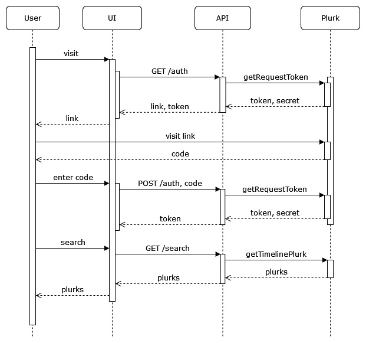
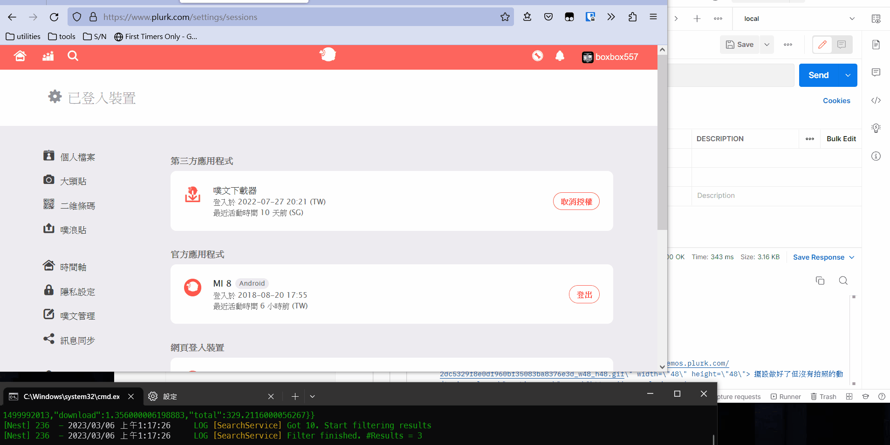

# 河道搜搜 Timeline Search

Having trouble finding a certain plurk in your Plurk timeline? Remembering seeing some funny plurk and you've liked it but couldn't find it anymore? We feel you!

Timeline Search (tmp name) is a tool that helps users to find a plurk with specific content in their timeline.

For example, it can search the plurks that you've replurked for a certain keyword.

The app is still under developing and has no UI currently, but the goal is to have a simple UI that users can login and do the search.

河道搜搜（暫定名稱）的目標是幫助噗浪使用者在自己的時間軸上搜索特定內容。

比如再已按過愛心的噗中搜索「食譜」，在所有轉噗過的內容中搜索特定標籤……

工具目前正在開發當中，不確定會拖多久，但目標就是這樣 :D

## About the tool

1. Language: [Typescript](https://github.com/microsoft/TypeScript)
2. Pacakge Manager: [Yarn 2+](https://yarnpkg.com/getting-started/install)
3. Framework: [Nest](https://github.com/nestjs/nest)
4. Git hook: [Husky](https://typicode.github.io/husky/#/)

## Getting Started

### Install dependencies
```
yarn
```

### Prepare environments:
We need to authenticate the user before we are able to pull data from their timeline.
To do so we need the key and secret to communicate with Plurk.
First, register a new plurk app here: https://www.plurk.com/PlurkApp/ (or you can reuse any existing one if there is one)
See also: https://www.plurk.com/API

Then copy `.env.sample` under this repo and rename it to `.env`.
Fill in `PLURK_APP_KEY` and `PLURK_APP_SECRET` with the key & secret you got from Plurk.
Enter random strings for `ENCRYPTION_KEY` and `JWT_SECRET`.
Modify `HOST` if you're hosting on a different hostname/port.

### serve
```
yarn start
```

Then you can access the api on http://localhost:3000/

### Development

```
# recompile upon file changes
yarn start:dev

# debug mode & reload upon file changes
yarn start:debug

# prod
yarn build && yarn start:prod
```

ps. this repo reinforces code style and code quality to pass by Husky hook.
You must fix all issues from eslint before committing, and must pass all tests before pushing.

linting

```
yarn lint
```

testing

```
yarn test
# or run tests upon file changes - extremely useful for TDD
yarn test:watch
```

## Workflow



API workflow demo


## Bug Report

Open an issue directly for any bug reports/feature requests/feedbacks.
Or you can contact me on [Plurk](https://plurk.com/boxbox557).

## License

This tool is [MIT licensed](https://github.com/cloudewu/plurk-search/blob/master/LICENSE).
